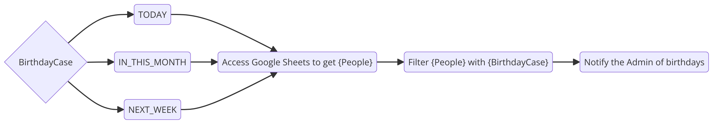

# Birthday Alert

Este projeto tem por finalidade enviar emails de aviso de aniversários de forma automática, baseado em triggers.

## 🏗️ Estrutura

O projeto foi organizado da seguinte forma:

```
.
├── src/
│ ├── @types
│ ├── constans/
│ ├── html/
│ ├── models/
│ ├── services/
│ ├── utils/
├── get-data-from-google-sheets.ts
├── index.ts
├── .env
├── .gitignore
├── package.json
├── README.md
├── tsconfig.json
├── vitest.config.ts
└── yarn.lock
```

Nessa estrutura, há algumas pastas importantes.

- `src/html`: Contém os templates de email utilizados;
- `src/models`: Contém as classes que abstraem uma pessoa com aniversário e as notificações de email; e
- `src/services`: Contém os serviços utilizados para o projeto, como `google-api` e `nodemailer`.

# 🔨 Funcionalidades do projeto

- Notificação via email
- Conexão com Google Sheets
- Disparos automáticos de rotinas

## ✔️ Tecnologias utilizadas

As tecnologias utilizadas para esse projeto foram:

- `Node`
- `Typescript`
- `Google API`
- `Node Mailer`
- `Node Schedule`
- `Vitest`

Para mais detalhes, deixo disponível o arquivo de configuração de dependências:

_package.json_

```json
"dependencies": {
    "dotenv": "^16.4.5",
    "googleapis": "105",
    "node-schedule": "^2.1.1",
    "nodemailer": "^6.9.14"
},
"devDependencies": {
    "@types/node": "^22.1.0",
    "@types/node-schedule": "^2.1.7",
    "@types/nodemailer": "^6.4.15",
    "@vitest/coverage-v8": "^2.0.5",
    "typescript": "^5.5.4",
    "vitest": "^2.0.5"
}
```

## Escopo

O escopo para esse projeto foi a possibilidade de receber emails de lembretes de aniversários de forma recorrente. Os métodos implementados foram:

- Aniversariantes no dia (TODAY)
- Aniversariantes na semana seguinte (NEXT_WEEK)
- Aniversariantes no mês (IN_THIS_MONTH)

## Execução do Projeto

Antes de executar o projeto, configura as variáveis ambiente. Há um exemplo no arquivo `.env.example` com o que é necessário.

```.env
ADMIN_EMAIL='...'
ADMIN_PASSWORD='...'

GOOGLE_SHEET_ID='...'
GOOGLE_SHEET_RANGE='...'

GCP_TYPE='...'
GCP_PROJECT_ID='...'
GCP_PRIVATE_KEY_ID='...'
GCP_PRIVATE_KEY='...'
GCP_CLIENT_EMAIL='...'
GCP_CLIENT_ID='...'
GCP_AUTH_URI='...'
GCP_TOKEN_URI='...'
GCP_AUTH_PROVIDER_X509_CERT_URL='...'
GCP_CLIENT_X509_CERT_URL='...'
GCP_UNIVERSE_DOMAIN='...'s
```

Após as variáveis ambientes configuradas, instale as dependências e execute o projeto com:

```shell
yarn
yarn dev
```

Caso queira algo mais espefício, veja a tabela abaixo com todos os comandos disponíveis:

| Comando       | Descriçãos                         |
| ------------- | ---------------------------------- |
| yarn build    | Gera o arquivo de `build`          |
| yarn start    | Executa o projeto em produção      |
| yarn dev      | Executa o projeto com o Typescript |
| yarn test     | Executa a pipe de testes           |
| yarn coverage | Gera um relatório de testes        |
